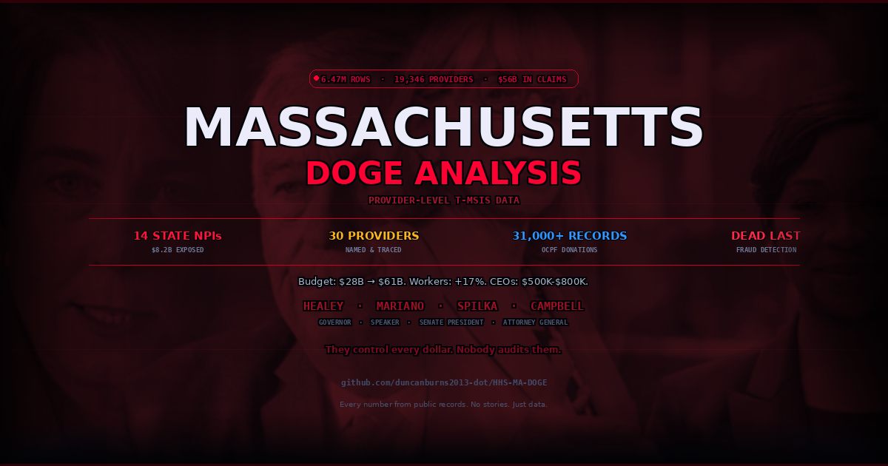

# 🔴 Massachusetts DOGE Analysis

### Provider-Level T-MSIS Data Investigation

**6.47 million rows. 19,346 providers. $56 billion in claims. 31,000+ campaign donations traced.**

---



---

## What This Is

A data-driven investigation into Massachusetts Medicaid (MassHealth) spending using federal CMS T-MSIS data, state CTHRU vendor payments, OCPF campaign finance records, and lobbying registrations. Every number sourced from public records.

**This is not journalism. This is a spreadsheet.**

---

## Key Findings

| Finding | Data |
|---------|------|
| **14 NPIs, 1 Department** | DDS (Dept of Developmental Services) uses 14 separate billing identities to bill $8.2B+ — no other state does this |
| **18.7× National Rate** | MA pays $2,109/day for group homes (T2016). Alabama pays $113/day. Same federal program. |
| **40× National Rate** | Home health aide visits (G0156): $320/visit vs $8 national average |
| **0.78× — The Exception** | T1019 Personal Care (Tempus Unlimited) bills BELOW national avg — private sector efficiency |
| **Dead Last in Fraud Detection** | 0.063% recovery rate vs Louisiana 0.90%. 18 investigators for 2.2M recipients. |
| **Zero Verification** | No IRS cross-check. No SSA cross-check. No interstate database. Healey refused USDA data sharing (Nov 2024). |
| **Revolving Door** | BMC CEO Walsh → EOHHS Secretary → BMC plan grew 71%. MGB spent $3.25M lobbying → $1.4B MCO (430× ROI). |
| **Budget Doubled, Wages Didn't** | $28B → $61B budget (+118%). Worker wages: +17%. CEO comp: $500K-$800K. |

---

## Interactive Dashboard

The dashboard is a single React component (JSX) designed to run in any React environment.

**File:** `ma_doge_analysis_v10.jsx`

### Sections:
1. **Top 30 Providers** — Every provider named by NPI, color-coded by type, with payment trends
2. **15 Billing Codes** — HCPCS codes with MA vs national rate comparisons
3. **DDS NPI Explorer** — 14 billing identities mapped and explained
4. **CTHRU Vendors** — 12 major vendors, FY21-FY25, sortable by year
5. **MCO Market Shift** — 5 managed care organizations, who's winning and why
6. **Pay-to-Play** — 11 entities, OCPF records, lobbying, money trails
7. **Fraud Detection Gap** — Verification failures, state comparison, siloed databases
8. **Cost of Living** — Ch.257 auto-escalation, union influence, budget vs wages
9. **Data Sources** — Per-vendor attribution

---

## Data Sources

### Federal
| Source | Description |
|--------|-------------|
| **CMS T-MSIS** | Provider-level Medicaid claims (6.47M rows) |
| **NPPES** | National Provider Identifier registry |
| **LEIE** | OIG List of Excluded Individuals/Entities |
| **DOL OLMS** | Union LM-2 financial filings |
| **OIG MFCU** | State fraud unit staffing & recovery reports |

### State
| Source | Description |
|--------|-------------|
| **CTHRU** | cthruspending.mass.gov — all vendor payments FY21-FY25 |
| **OCPF** | Office of Campaign & Political Finance (31,000+ records) |
| **SOS Lobbyist Registry** | Lobbying registrations & expenditures |
| **State Auditor** | Ch.257 audits, MassHealth findings |
| **MA SOS Corps Division** | Corporate filings (e.g., Caregiver Homes) |

### Financial
| Source | Description |
|--------|-------------|
| **IRS 990** | Nonprofit CEO compensation (via ProPublica) |
| **AG Public Charities** | Nonprofit financial filings |
| **SEC** | Hospital system disclosures |

---

## The Players

| Name | Role | Connection |
|------|------|------------|
| **Maura Healey** | Governor | Refused USDA data sharing (Nov 2024). $61B budget. |
| **Ron Mariano** | House Speaker | Controls all healthcare spending bills. Top OCPF recipient. |
| **Karen Spilka** | Senate President | Ch.257 rate increases pass through her chamber. |
| **Andrea Campbell** | Attorney General | Enforcement authority. OCPF recipient from nonprofits. |
| **Kate Walsh** | Fmr EOHHS Sec / BMC CEO | Hospital CEO → ran $27B state agency → hospital plan grew 71% |
| **Eric Dickson** | UMass Memorial CEO | Only hospital CEO in America who is also a registered lobbyist. $3.9M salary. |
| **David Jordan** | Seven Hills CEO | $797K. Chairs ADDP trade group that lobbies for his own rates. |
| **Chris Philbin** | MGB Lobbyist | Donated $31K to 47 politicians. MGB got $1.4B MCO. |

---

## The Money Cycle

```
Workers (71,000) pay mandatory dues ($10M+/yr)
    → Union PACs ($14.09M — 1199SEIU alone)
        → Democratic legislators (Mariano, Spilka, Michlewitz)
            → Ch.257 rate increases (auto-escalation, no review)
                → Nonprofit CEO comp ($500K-$800K)
                    → Trade groups lobby for more ($7.6M/yr)
                        → Repeat. Budget: $28B → $61B.
```

**Workers got +17%. The cycle got +118%.**

---

## Methodology

- All billing code comparisons use CMS HCPCS definitions and T-MSIS national averages
- Provider identification via NPPES NPI lookup
- CTHRU data pulled directly from cthruspending.mass.gov
- OCPF records from ocpf.us (Massachusetts campaign finance database)
- Lobbying data from Secretary of State public filings
- CEO compensation from IRS 990 via ProPublica Nonprofit Explorer
- Corporate filings from MA Secretary of State Corporations Division
- No news articles used as primary sources — data only

---

## Files

| File | Description |
|------|-------------|
| `README.md` | This file |
| `ma_doge_analysis_v10.jsx` | Interactive React dashboard (v10) |
| `social_card.png` | OG social card for link previews |

---

## Author

**Duncan Burns** — Haverhill, MA

- Twitter/X: [@DuncanBurnsMA](https://x.com/DuncanBurnsMA)
- GitHub: [duncanburns2013-dot](https://github.com/duncanburns2013-dot)

---

## License

Public domain. This is public data about public spending of public money by public officials. Use it.

---

*Every number sourced from public records. No stories. Just data.*
