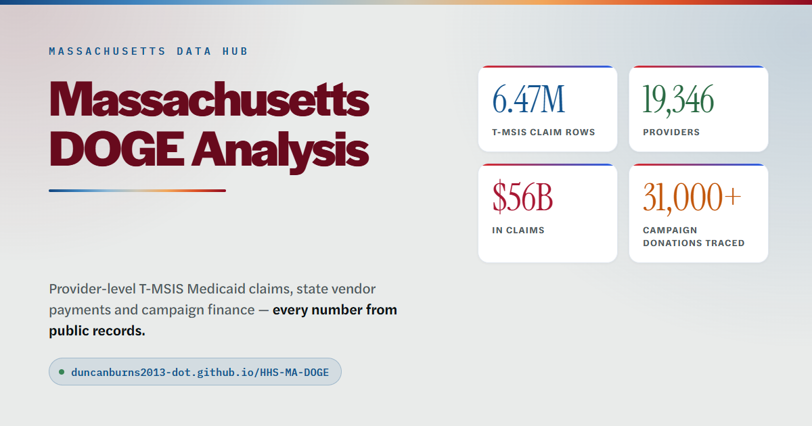

# 🔴 Massachusetts DOGE Analysis

### Provider-Level T-MSIS Data Investigation

**6.47 million rows. 19,346 providers. $56 billion in claims. 31,000+ campaign donations traced.**

### 🔗 [VIEW THE LIVE DASHBOARD](https://duncanburns2013-dot.github.io/HHS-MA-DOGE/)

---



---

## 🆕 What's New — May 2026

- **SFI cross-reference · 2026-05-27** — 29,729 redacted MA Statement-of-Financial-Interest filings 2019–2025 (bulk release from the MA State Ethics Commission) were cross-referenced against this repository's flagged-entity data. A word-boundary substring scan for "Tempus" in the Q7 (Spouse Business Employment) section of every filing returned 28 hits across 8 unique filers; every hit was independently re-verified by live PDF text re-extraction. Tempus Unlimited, Inc. (EIN 04-2239746, the MA disability-services nonprofit at 600 Technology Center Drive, Stoughton — not Tempus AI / NASDAQ TEM) is the sole statewide MassHealth PCA Fiscal Intermediary. Full sourced doc: [`enforcement/SFI-CROSSREF.md`](enforcement/SFI-CROSSREF.md). Corpus + searchable UI: [`duncanburns2013-dot/The-Peoples-Audit`](https://github.com/duncanburns2013-dot/The-Peoples-Audit). No wrongdoing by any named individual or by Tempus Unlimited is alleged; the disclosures cited are the officials' own lawful filings.
- **HHS DOGE Medicaid Provider Spending dataset (Feb 2026)** — the largest public Medicaid claims aggregation ever released. 10 GB, 227M+ rows, provider × HCPCS × month, 2018–2024. Ingest script: [`data/fraud-detection/ingest_hhs_doge_provider_spending.py`](data/fraud-detection/ingest_hhs_doge_provider_spending.py)
- **Enforcement layer** — new [`enforcement/`](enforcement/) folder cross-references this investigation against:
  - [SFI cross-reference (2026)](enforcement/SFI-CROSSREF.md) — 29,729 MA SFI filings 2019–2025, Tempus spouse-employment pattern, real-estate overlaps
  - [2026 MA AG indictments](enforcement/2026-MA-INDICTMENTS.md) (Waltham NEMT $770K, $7.8M home-health/lab/physician kickback ring, UHS $15M+ settlement)
  - [State Auditor BSI FY25](enforcement/STATE-AUDITOR-BSI-FY25.md) — $11.95M public-benefit fraud identified + March 2026 follow-up
  - [HHS OIG MFCU FY2025](enforcement/HHS-OIG-MFCU-FY25.md) — $2B recoveries, 1,185 convictions, active OIG focus on EVV data
  - [DOJ routing](enforcement/DOJ-ROUTING.md) — how to reach the **New England Strike Force** (USAO-MA + FBI + HHS-OIG + MA MFCU) instead of mainline DOJ
- **Full changelog:** [`NEW-DATA-2026.md`](NEW-DATA-2026.md)

---

## What This Is

A data-driven investigation into Massachusetts Medicaid (MassHealth) spending using federal CMS T-MSIS data, state CTHRU vendor payments, OCPF campaign finance records, and lobbying registrations. Every number sourced from public records.

**This is not journalism. This is a spreadsheet.**

---

## Key Findings

| Finding | Data |
|---------|------|
| **24 NPIs, 1 Department** | 24 NPIs named Commonwealth of Massachusetts billed T2016 group home services: $8.93B in 2018-24 (HHS provider spending file). Multiple NPIs per state provider site is normal NPPES practice. |
| **1.38× State Median (T2016)** | Group homes: MA paid $13,948 per beneficiary-month in 2024 vs a state median of $10,099 (13th of 38 states). MA bills about one claim line per person-month, so per-line amounts are not daily rates. |
| **G0156 Home Health Aide** | Billed per 15 minutes, not per visit. On lines with a payment, MA paid $212.70 per claim line in 2023, 2nd of 16 paying states (NY $267.86). |
| **9.24× State Median (T1502)** | Medication administration visits, billed mostly by home health agencies: $66.48 per claim line in 2024 vs a state median of $7.20 (3rd of 17 states). A red flag for review. |
| **T1019 Personal Care** | Tempus Unlimited took 70.3% of MA T1019 payments in 2020-24. No valid cross-state rate comparison: the code is billed per 15 minutes. |
| **Dead Last in Fraud Detection** | 0.063% recovery rate vs Louisiana 0.90%. 18 investigators for 2.2M recipients. |
| **Zero Verification** | No IRS cross-check. No SSA cross-check. No interstate database. Healey refused USDA data sharing (Nov 2024). |
| **Revolving Door** | BMC CEO Walsh → EOHHS Secretary → BMC plan grew 71%. MGB spent $3.25M lobbying → $1.4B MCO (430× ROI). |
| **Budget Doubled, Wages Didn't** | $28B → $61B budget (+118%). Worker wages: +17%. CEO comp: $500K-$800K. |

Per-line paid amounts are not prices: the HHS file has no units field, and states bill different units per line. Rates above are red flags for review, not proof of overbilling. Massachusetts sets its own rates (101 CMR). State comparisons: HHS Medicaid Provider Spending by HCPCS, 2026-02-09 release (2024 preliminary).

---

## Interactive Dashboard

The dashboard is a single React component (JSX) designed to run in any React environment.

**File:** `ma_doge_analysis_v10.jsx`

### Sections:
1. **Top 30 Providers** — Every provider named by NPI, color-coded by type, with payment trends
2. **15 Billing Codes** — HCPCS codes with MA vs national rate comparisons
3. **DDS NPI Explorer** — 14 billing identities mapped and explained
4. **CTHRU Vendors** — 12 major vendors, FY21-FY25, sortable by year
5. **MCO Market Shift** — 5 managed care organizations, who's winning and why
6. **Pay-to-Play** — 11 entities, OCPF records, lobbying, money trails
7. **Fraud Detection Gap** — Verification failures, state comparison, siloed databases
8. **Cost of Living** — Ch.257 auto-escalation, union influence, budget vs wages
9. **Data Sources** — Per-vendor attribution

---

## Data Sources

### Federal
| Source | Description |
|--------|-------------|
| **CMS T-MSIS** | Provider-level Medicaid claims (6.47M rows) |
| **HHS DOGE Provider Spending** *(NEW — Feb 2026)* | Provider × HCPCS × month, 2018–2024, 227M rows — opendata.hhs.gov |
| **CMS T-MSIS TAF 2023 + 2024** *(NEW — 2026)* | Refreshed annual analytic files |
| **NPPES** | National Provider Identifier registry |
| **LEIE** | OIG List of Excluded Individuals/Entities |
| **DOL OLMS** | Union LM-2 financial filings |
| **HHS OIG MFCU FY2025** *(NEW — 2026)* | $2B Medicaid recoveries, 1,185 convictions |
| **DOJ Health Care Fraud Unit — NE Strike Force** *(NEW)* | MA-specific federal enforcement |

### State
| Source | Description |
|--------|-------------|
| **CTHRU** | cthruspending.mass.gov — all vendor payments FY21-FY25 |
| **OCPF** | Office of Campaign & Political Finance (31,000+ records) |
| **SOS Lobbyist Registry** | Lobbying registrations & expenditures |
| **State Auditor** | Ch.257 audits, MassHealth findings |
| **MA State Auditor BSI FY25** *(NEW — 2026)* | $11.95M public-benefit fraud cases incl. MassHealth |
| **MA SOS Corps Division** | Corporate filings (e.g., Caregiver Homes) |

### Financial
| Source | Description |
|--------|-------------|
| **IRS 990** | Nonprofit CEO compensation (via ProPublica) |
| **AG Public Charities** | Nonprofit financial filings |
| **SEC** | Hospital system disclosures |

---

## The Players

| Name | Role | Connection |
|------|------|------------|
| **Maura Healey** | Governor | Refused USDA data sharing (Nov 2024). $61B budget. |
| **Ron Mariano** | House Speaker | Controls all healthcare spending bills. Top OCPF recipient. |
| **Karen Spilka** | Senate President | Ch.257 rate increases pass through her chamber. |
| **Andrea Campbell** | Attorney General | Enforcement authority. OCPF recipient from nonprofits. |
| **Kate Walsh** | Fmr EOHHS Sec / BMC CEO | Hospital CEO → ran $27B state agency → hospital plan grew 71% |
| **Eric Dickson** | UMass Memorial CEO | Only hospital CEO in America who is also a registered lobbyist. $3.9M salary. |
| **David Jordan** | Seven Hills CEO | $797K. Chairs ADDP trade group that lobbies for his own rates. |
| **Chris Philbin** | MGB Lobbyist | Donated $31K to 47 politicians. MGB got $1.4B MCO. |

---

## The Money Cycle

```
Workers (71,000) pay mandatory dues ($10M+/yr)
    → Union PACs ($14.09M — 1199SEIU alone)
        → Democratic legislators (Mariano, Spilka, Michlewitz)
            → Ch.257 rate increases (auto-escalation, no review)
                → Nonprofit CEO comp ($500K-$800K)
                    → Trade groups lobby for more ($7.6M/yr)
                        → Repeat. Budget: $28B → $61B.
```

**Workers got +17%. The cycle got +118%.**

---

## Methodology

- All billing code comparisons use CMS HCPCS definitions and T-MSIS national averages
- Provider identification via NPPES NPI lookup
- CTHRU data pulled directly from cthruspending.mass.gov
- OCPF records from ocpf.us (Massachusetts campaign finance database)
- Lobbying data from Secretary of State public filings
- CEO compensation from IRS 990 via ProPublica Nonprofit Explorer
- Corporate filings from MA Secretary of State Corporations Division
- No news articles used as primary sources — data only

---

## Files

| File | Description |
|------|-------------|
| `README.md` | This file |
| `ma_doge_analysis_v10.jsx` | Interactive React dashboard (v10) |
| `social_card.png` | OG social card for link previews |

---

## Author

**Duncan Burns** — Haverhill, MA

- Twitter/X: [@DuncanBurnsMA](https://x.com/DuncanBurnsMA)
- GitHub: [duncanburns2013-dot](https://github.com/duncanburns2013-dot)

---

## License

Public domain. This is public data about public spending of public money by public officials. Use it.

---

*Every number sourced from public records. No stories. Just data.*
